# TUGAS 9 Pertemuan 11 – Manajemen Data Produk (Tokokita)

Aplikasi **Tokokita** adalah aplikasi *mobile* yang dibangun menggunakan Flutter untuk mengelola data produk toko. Aplikasi ini menerapkan konsep **REST API** untuk komunikasi data dan fitur **CRUD (Create, Read, Update, Delete)** yang lengkap, serta sistem autentikasi pengguna.

## 📋 Fitur Utama
* **Registrasi Member:** Pendaftaran akun baru.
* **Login & Logout:** Autentikasi aman menggunakan Token.
* **List Produk:** Menampilkan daftar produk dari database.
* **Tambah Produk:** Menambahkan data produk baru.
* **Ubah Produk:** Mengedit informasi produk.
* **Detail Produk:** Melihat rincian lengkap produk.
* **Hapus Produk:** Menghapus produk yang tidak diinginkan.

---

## 📱 Alur Kerja Aplikasi (Walkthrough)

Berikut adalah penjelasan detail mengenai setiap proses dalam aplikasi beserta *screenshot* dan implementasi kodenya.

### 1. Proses Registrasi
Halaman ini memungkinkan pengguna baru untuk mendaftar. Sistem akan memvalidasi input sebelum mengirim data ke server.

| Form Kosong (Validasi) | Pengisian Form | Registrasi Berhasil |
| :---: | :---: | :---: |
| 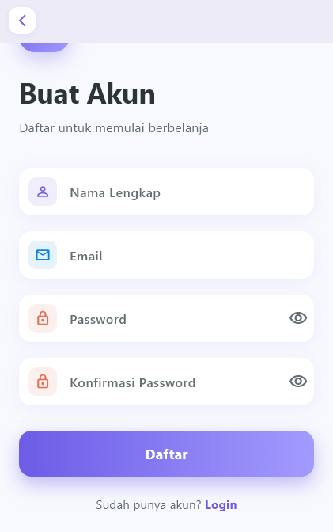 | 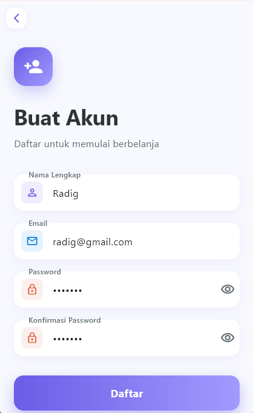 | 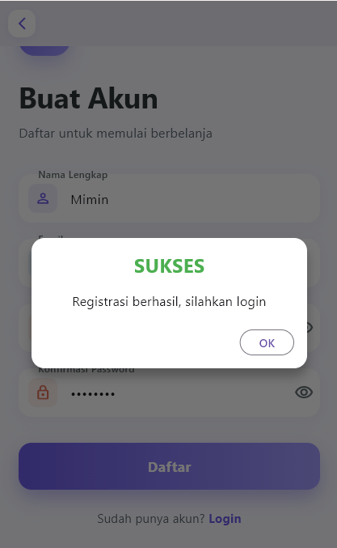 |

**Penjelasan Proses:**
1.  Pengguna membuka halaman registrasi. Jika tombol "Daftar" ditekan saat kosong, validasi akan muncul.
2.  Pengguna mengisi Nama, Email, dan Password (beserta konfirmasi).
3.  Saat tombol "Daftar" ditekan, fungsi `registrasi` pada BLoC dipanggil. Jika sukses, muncul *popup* sukses.

**Kode Implementasi (`lib/bloc/registrasi_bloc.dart`):**
```dart
static Future<Registrasi> registrasi({String? nama, String? email, String? password}) async {
  String apiUrl = ApiUrl.registrasi; 
  var body = {
    "nama": nama,
    "email": email,
    "password": password,
  };
  var response = await Api().post(apiUrl, body);
  var jsonObj = json.decode(response.body);
  return Registrasi.fromJson(jsonObj);
}
```
### 2. Proses Login
Setelah memiliki akun, pengguna masuk untuk mendapatkan akses ke menu produk.

| Validasi Form Login | Input Email & Password |
| :---: | :---: |
| 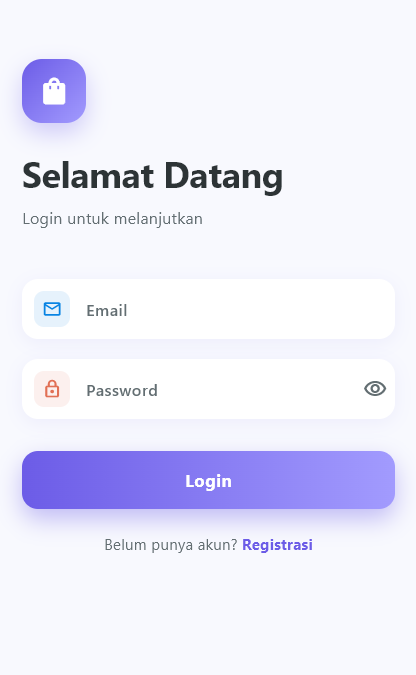 | 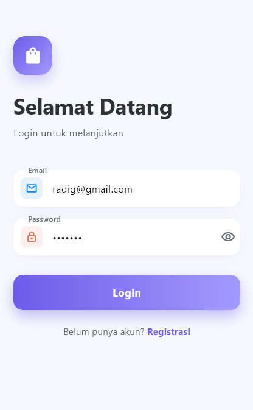 |

**Penjelasan Proses:**
1. Validasi memastikan email dan password tidak boleh kosong.
2. Pengguna memasukkan kredensial yang valid.
3. Jika login berhasil (kode 200), Token dan User ID disimpan ke penyimpanan lokal `(SharedPreferences)` dan pengguna diarahkan ke halaman List Produk.

**Kode Implementasi (`lib/ui/login_page.dart`):**
```dart
LoginBloc.login(
  email: _emailTextboxController.text,
  password: _passwordTextboxController.text,
).then((value) async {
  if (value.code == 200) {
    // Simpan token untuk sesi
    await UserInfo().setToken(value.token.toString());
    await UserInfo().setUserID(int.parse(value.userID.toString()));
    
    // Pindah ke halaman utama
    Navigator.pushReplacement(context,
      MaterialPageRoute(builder: (context) => const ProdukPage()));
  } else {
    // Tampilkan pesan gagal
    showDialog(...);
  }
});
```
### 3. Menampilkan List Produk (Read)
Halaman ini adalah menu utama yang menampilkan semua produk yang tersedia.

| List Produk |
| :---: |
|  |

**Penjelasan Proses:**
Aplikasi mengambil data produk dari API menggunakan *GET request*. Data JSON yang diterima kemudian di-*parsing* menjadi objek `Produk` dan ditampilkan dalam bentuk *ListView*.

**Kode Implementasi (`lib/bloc/produk_bloc.dart`):**
```dart
static Future<List<Produk>> getProduks() async {
  String apiUrl = ApiUrl.listProduk;
  var response = await Api().get(apiUrl);
  var jsonObj = json.decode(response.body);
  
  List<dynamic> listProduk = (jsonObj as Map<String, dynamic>)['data'];
  List<Produk> produks = [];
  for (var item in listProduk) {
    produks.add(Produk.fromJson(item));
  }
  return produks;
}
```
### 4. Proses Tambah Data Produk (Create)
Pengguna dapat menambahkan barang dagangan baru melalui tombol tambah (+).

| Form Tambah Produk | Input Data Produk | Hasil Penambahan |
| :---: | :---: | :---: |
|  | 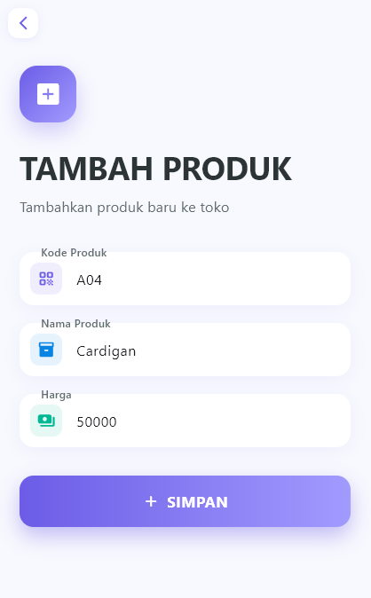 | 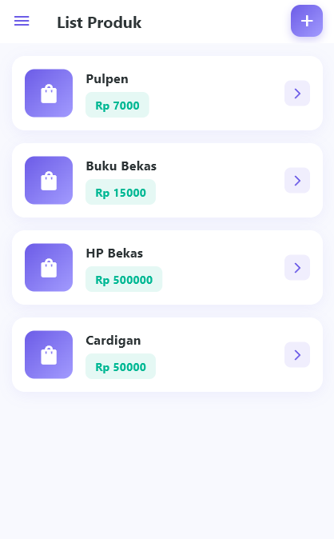 |

**Penjelasan Proses:**
1.  Halaman `ProdukForm` dibuka dalam mode "TAMBAH".
2.  Pengguna mengisi Kode Produk, Nama Barang, dan Harga.
3.  Tombol "SIMPAN" memicu fungsi `addProduk` ke API. Setelah berhasil, pengguna kembali ke halaman List dan produk baru (contoh: Cardigan) muncul.

**Kode Implementasi (`lib/ui/produk_form.dart`):**
```dart
simpan() {
  setState(() { _isLoading = true; });
  Produk createProduk = Produk(id: null);
  createProduk.kodeProduk = _kodeProdukTextboxController.text;
  createProduk.namaProduk = _namaProdukTextboxController.text;
  createProduk.hargaProduk = int.parse(_hargaProdukTextboxController.text);

  ProdukBloc.addProduk(produk: createProduk).then((value) {
    // Kembali ke list produk jika sukses
    Navigator.of(context).push(MaterialPageRoute(
        builder: (BuildContext context) => const ProdukPage()));
  }, onError: (error) {
    showDialog(
        context: context,
        builder: (BuildContext context) => const WarningDialog(
          description: "Simpan gagal, silahkan coba lagi",
        ));
  });
  setState(() { _isLoading = false; });
}
```
### 5. Detail & Edit Produk (Update)
Fitur ini memungkinkan pengguna untuk melihat rincian produk dan melakukan perubahan data jika diperlukan.

| Detail Produk | Form Ubah Produk |
| :---: | :---: |
| 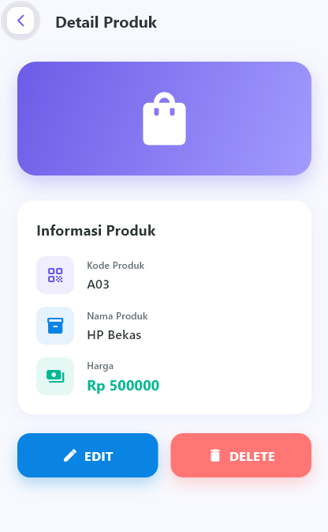 | 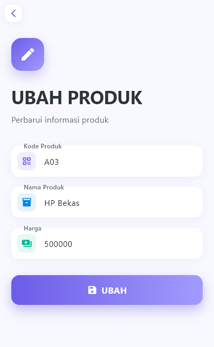 |

**Penjelasan Proses:**
1.  Dari halaman **List Produk**, pengguna memilih salah satu item untuk membuka halaman **Detail Produk**.
2.  Pada halaman detail, pengguna menekan tombol **EDIT**. Aplikasi akan menavigasi ke **ProdukForm**.
3.  Halaman form mendeteksi adanya data produk yang dikirim, sehingga kolom input otomatis terisi dengan data lama (*Pre-filled*) dan tombol berubah menjadi "UBAH".
4.  Setelah data diedit dan tombol "UBAH" ditekan, fungsi `updateProduk` dipanggil untuk memperbarui data di server.

**Kode Implementasi (`lib/bloc/produk_bloc.dart`):**
```dart
static Future updateProduk({required Produk produk}) async {
  String apiUrl = ApiUrl.updateProduk(produk.id!);
  print("URL Update: $apiUrl");

  var body = {
    "kode_produk": produk.kodeProduk,
    "nama_produk": produk.namaProduk,
    "harga": produk.hargaProduk.toString(),
  };

  var response = await Api().put(apiUrl, jsonEncode(body));
  var jsonObj = json.decode(response.body);

  return jsonObj['status'];
}
```
### 6. Hapus Produk (Delete)
Fitur ini memungkinkan pengguna untuk menghapus produk dari database, dilengkapi dengan konfirmasi keamanan untuk mencegah ketidaksengajaan.

| Konfirmasi Hapus | Produk Terhapus |
| :---: | :---: |
| 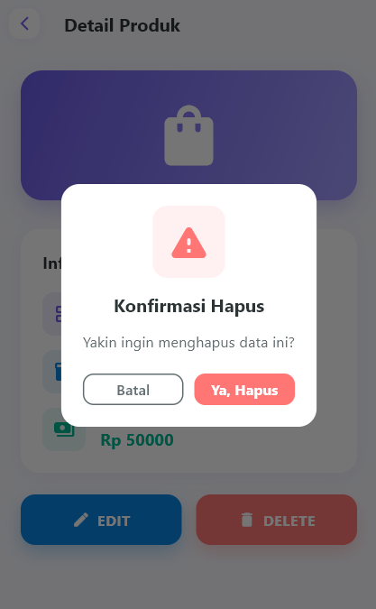 | 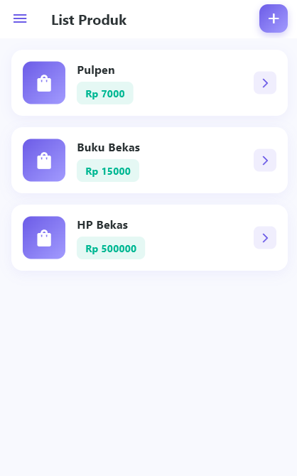 |

**Penjelasan Proses:**
1.  Pada halaman **Detail Produk**, pengguna menekan tombol **DELETE**.
2.  Aplikasi akan memunculkan *Dialog Konfirmasi* dengan pesan "Yakin ingin menghapus data ini?".
3.  Jika pengguna memilih **"Ya, Hapus"**, aplikasi akan memanggil fungsi `deleteProduk` di BLoC.
4.  Setelah penghapusan berhasil, pengguna diarahkan kembali ke halaman **List Produk**, di mana produk yang dihapus (contoh: Kamera) sudah tidak ada.

**Kode Implementasi (`lib/ui/produk_detail.dart`):**
```dart
void confirmHapus() {
  showDialog(
    context: context,
    builder: (context) => AlertDialog(
      title: const Text("Konfirmasi Hapus"),
      content: const Text("Yakin ingin menghapus data ini?"),
      actions: [
        OutlinedButton(
          onPressed: () => Navigator.pop(context),
          child: const Text("Batal"),
        ),
        ElevatedButton(
          onPressed: () {
            ProdukBloc.deleteProduk(id: widget.produk!.id).then((value) {
              Navigator.of(context).push(
                MaterialPageRoute(builder: (context) => const ProdukPage()),
              );
            }, onError: (error) {
              showDialog(
                context: context,
                builder: (BuildContext context) => const WarningDialog(
                  description: "Hapus gagal, silahkan coba lagi",
                ),
              );
            });
          },
          child: const Text("Ya, Hapus"),
        ),
      ],
    ),
  );
}
```
### 7. Logout
Fitur ini memungkinkan pengguna untuk keluar dari aplikasi, yang akan menghapus sesi login (token) dari penyimpanan lokal dan mengembalikan pengguna ke halaman Login.

| Menu Logout (Drawer) |
| :---: |
| 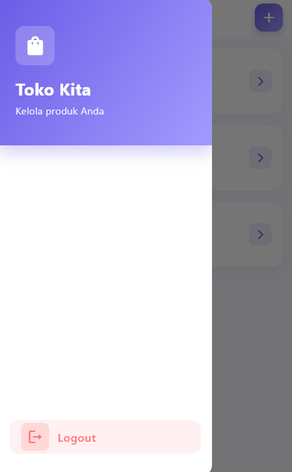 |

**Penjelasan Proses:**
1.  Di halaman **List Produk**, pengguna menekan tombol menu (hamburger icon) di pojok kiri atas untuk membuka *Drawer*.
2.  Di dalam *Drawer*, terdapat opsi **Logout**.
3.  Saat tombol Logout ditekan, aplikasi memanggil fungsi `LogoutBloc.logout()`.
4.  Fungsi tersebut akan menghapus data sesi (Token & User ID) dari `SharedPreferences`.
5.  Setelah sesi dihapus, aplikasi secara otomatis menavigasi kembali ke **Halaman Login** dan menghapus riwayat navigasi sebelumnya agar pengguna tidak bisa kembali (back) ke halaman produk tanpa login ulang.

**Kode Implementasi (`lib/ui/produk_page.dart`):**
```dart
// Pada Widget Drawer
ListTile(
  leading: const Icon(Icons.logout_rounded, color: Color(0xFFFF7675)),
  title: const Text('Logout', style: TextStyle(color: Color(0xFFFF7675))),
  onTap: () async {
    await LogoutBloc.logout().then((value) => {
      Navigator.of(context).pushAndRemoveUntil(
        MaterialPageRoute(builder: (context) => const LoginPage()),
        (route) => false, // Hapus stack navigasi
      )
    });
  },
),
```
**Kode Implementasi Logika (`lib/bloc/logout_bloc.dart` & `lib/helpers/user_info.dart`):**
```dart
// LogoutBloc
class LogoutBloc {
  static Future logout() async {
    await UserInfo().logout();
  }
}

// UserInfo Helper
Future logout() async {
  final SharedPreferences pref = await SharedPreferences.getInstance();
  return pref.clear(); // Menghapus semua key (token, userID, dll)
}
```
