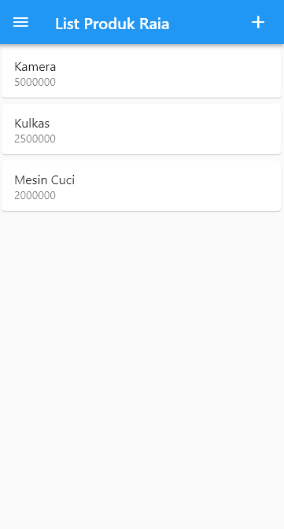
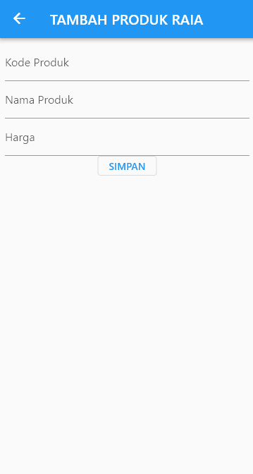
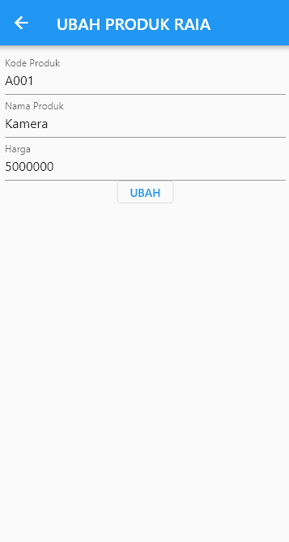
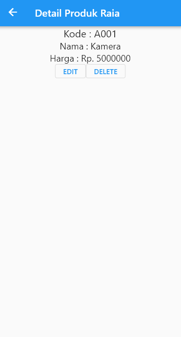

# TUGAS 8 – Pertemuan 10  
Aplikasi CRUD Produk menggunakan Flutter dan REST API.  
Fitur yang dibangun:  
- Menampilkan list produk  
- Menambah produk  
- Mengedit produk  
- Melihat detail produk  
- Menghapus produk  

---

## Screenshots Aplikasi

| **List Produk** | **Tambah Produk** |
|-----------------|-------------------|
|  |  |

| **Edit Produk** | **Detail Produk** |
|-----------------|-------------------|
|  |  |

---

## Penjelasan Halaman

### 1. ProdukPage
Halaman ini menampilkan **daftar produk** dalam bentuk list.  
Pengguna dapat:
- Melihat semua produk
- Tap item untuk membuka detail
- Menekan tombol **+** untuk menambah produk baru  
Halaman ini menjadi **menu utama** aplikasi.

---

### 2. ProdukForm
Halaman ini digunakan untuk **menambah atau mengubah produk**.  
Memiliki form input:
- Kode Produk
- Nama Produk
- Harga  
Jika halaman dibuka dengan data produk → mode **edit**, jika kosong → mode **tambah**.

---

### 3. ProdukDetail
Halaman ini menampilkan **detail lengkap** dari satu produk.  
Pengguna dapat:
- Melihat informasi produk
- Menekan tombol **EDIT** untuk mengubah produk
- Menekan **DELETE** untuk menghapus produk  
Halaman ini menerima data produk melalui parameter saat navigasi dari ProdukPage.

---
